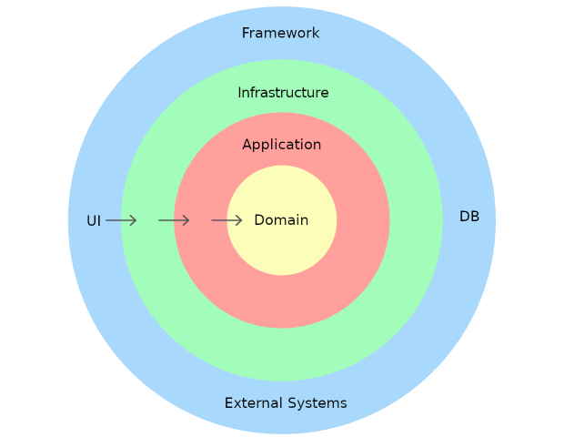

# 💳 Sistema de Gestión de Pagos de Servicios Básicos — *Payment API*

Este repositorio contiene la **API interna para registrar y consultar pagos de servicios básicos** (agua, electricidad, telecomunicaciones) realizados por los clientes.  
El sistema sigue los principios de **CQRS (Command Query Responsibility Segregation)** y **Domain-Driven Design (DDD)**, y se puede ejecutar con **Docker**.

---

## 🏗️ Stack Tecnológico

| Componente | Tecnología |
|-------------|-------------|
| **Framework** | .NET 8 (C#) |
| **Arquitectura** | CQRS + DDD (con MediatR) |
| **Base de Datos** | PostgreSQL |
| **ORM** | Entity Framework Core |
| **Contenedores** | Docker & Docker Compose |

---

## 🧱 Arquitectura

El proyecto sigue una arquitectura limpia y modular con 4 capas principales:


---


## 📐 Diagrama de Clases


---

## 🐳 Despliegue con Docker

La aplicación se ejecuta completamente dentro de contenedores usando **Docker Compose**.

### 📋 Prerrequisitos

Antes de ejecutar el proyecto asegúrate de tener instalado:

- [Docker Desktop](https://www.docker.com/get-started) o Docker Engine
- [Docker Compose v2+](https://docs.docker.com/compose/)

---

## ⚙️ Configuración de Contenedores

El proyecto incluye dos servicios principales definidos en `docker-compose.yml`:

### 🧩 Servicios

| Servicio | Descripción | Puerto Host |
|-----------|--------------|-------------|
| `payment-service` | API Web principal (basada en .NET 8) | **5017** |
| `db_service` | Base de datos PostgreSQL personalizada | **5440** |


## 🚀 Ejecución del Proyecto

### 1. Construir e iniciar los contenedores

Desde la raíz del proyecto:

```bash
docker compose up --build
```
### 2. Acceder a la API
Una vez levantado, la API estará disponible en:
👉 http://localhost:5017/swagger/index.html

---
## 📡 Endpoints Principales

### 🧾 1. Registrar un Pago (Command)

**Método:** `POST`  
**Ruta:** `/api/payments`  
**Descripción:** Registra un nuevo pago realizado por un cliente en el sistema.

#### Request Body (JSON)

```json
{
  "customerId": "cfe8b150-2f84-4a1a-bdf4-923b20e34973",
  "serviceProvider": "SERVICIOS ELÉCTRICOS S.A.",
  "amount": 120.50
}
```

### 2. Consultar Pagos por Cliente (Query)

**Método:** `GET`  
**Ruta:** `/api/payments`  
**Descripción:** Obtiene el historial de pagos asociados a un cliente.
#### Parámetros de Consulta
| Nombre | Tipo | Requerido |
|-----------|--------------|-------------|
| `customerId` | string (Guid) | ✅ |

#### 
```bash
GET /api/payments?customerId=cfe8b150-2f84-4a1a-bdf4-923b20e34973
```
---


